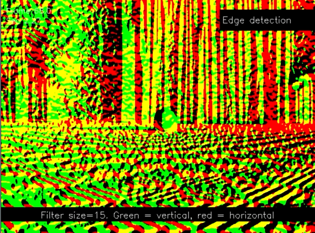
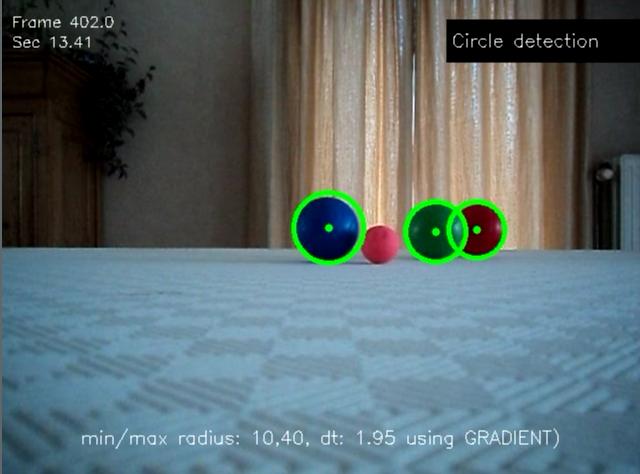
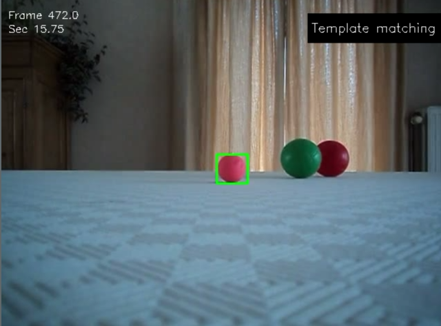
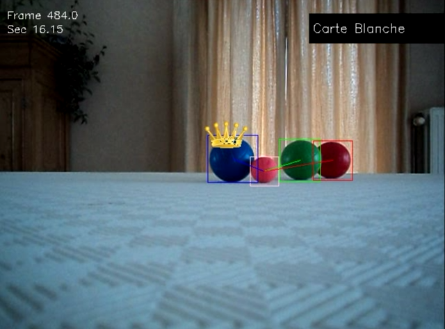

# OpenCV
Basic image filtering and object detection in OpenCV.

Includes:
- Blurring
- Bilateral filtering
- Color grabbing (with morphological operations)
- Edge detection (with Sobel)
- Circle detection (with Hough)
- Object detection using template matching
- Analyzing a game of 'petanque'

# Some screenshots

